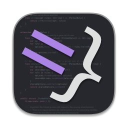

[](https://www.paypal.com/cgi-bin/webscr?cmd=_s-xclick&hosted_button_id=9ZGWNK5FEZFF6&source=url)
[](https://travis-ci.org/nicklockwood/SwiftFormat)
[](https://codecov.io/gh/nicklockwood/SwiftFormat)
[](https://developer.apple.com/swift)
[](https://opensource.org/licenses/MIT)
[](http://twitter.com/nicklockwood)

Table of Contents
-----------------

- [What?](#what-is-this)
- [Why?](#why-would-i-want-to-do-that)
- [How?](#how-do-i-install-it)
    - [Command-line tool](#command-line-tool)
    - [Xcode source editor extension](#xcode-source-editor-extension)
    - [Xcode build phase](#xcode-build-phase)
    - [Via Applescript](#via-applescript)
    - [VSCode plugin](#vscode-plugin)
    - [Sublime Text plugin](#sublime-text-plugin)
    - [Git pre-commit hook](#git-pre-commit-hook)
    - [On CI using Danger](#on-ci-using-danger)
- [Configuration](#configuration)
    - [Options](#options)
    - [Rules](#rules)
    - [Swift version](#swift-version)
    - [Config file](#config-file)
    - [Globs](#globs)
    - [Linting](#linting)
    - [Cache](#cache)
    - [File headers](#file-headers)
- [FAQ](#faq)
- [Known issues](#known-issues)
- [Tip Jar](#tip-jar)
- [Credits](#credits)


What is this?
----------------

SwiftFormat is a code library and command-line tool for reformatting Swift code on macOS or Linux.

SwiftFormat goes above and beyond what you might expect from a code formatter. In addition to adjusting white space it can insert or remove implicit `self`, remove redundant parentheses, and correct many other deviations from the standard Swift idioms.

Why would I want to do that?
-----------------------------

Many programmers have a preferred style for formatting their code, and others seem entirely blind to the existing formatting conventions of a project (to the enragement of their colleagues).

When collaborating on a project, it can be helpful to agree on a common coding style, but enforcing that manually is tedious and error-prone, and can lead to arguments if some participants take it more seriously than others.

Having a tool to automatically enforce a common style eliminates those issues, and lets you focus on the behavior of the code, not its presentation.


How do I install it?
---------------------

That depends - There are several ways you can use SwiftFormat:

1. As a command-line tool that you run manually, or as part of some other toolchain
2. As a Source Editor Extension that you can invoke via the Editor > SwiftFormat menu within Xcode
3. As a build phase in your Xcode project, so that it runs every time you press Cmd-R or Cmd-B, or
4. As a Git pre-commit hook, so that it runs on any files you've changed before you check them in


Command-line tool
-------------------

**NOTE:** if you are using any of the following methods to install SwiftFormat on macOS 10.14.3 or earlier and are experiencing a crash on launch, you may need to install the [Swift 5 Runtime Support for Command Line Tools](https://support.apple.com/kb/DL1998). See [known issues](#known-issues) for details.

**Installation:**

You can install the `swiftformat` command-line tool on macOS using [Homebrew](http://brew.sh/). Assuming you already have Homebrew installed, just type:

```bash
$ brew install swiftformat
```

To update to the latest version once installed:

```bash
$ brew upgrade swiftformat
```

Alternatively, you can install the tool on macOS or Linux by using [Mint](https://github.com/yonaskolb/Mint) as follows:

```bash
$ mint install nicklockwood/SwiftFormat
```

And then run it using:

```bash
$ mint run swiftformat
```

Or if you prefer, you can check out and build SwiftFormat manually on macOS or Linux as follows:

```bash
$ git clone https://github.com/nicklockwood/SwiftFormat
$ cd SwiftFormat
$ swift build -c release
```

If you are installing SwiftFormat into your project directory, you can use [CocoaPods](https://cocoapods.org/) on macOS to automatically install the swiftformat binary along with your other pods - see the Xcode build phase instructions below for details.

If you would prefer not to use a package manager, you can build the command-line app manually:

1. open `SwiftFormat.xcodeproj` and build the `SwiftFormat (Application)` scheme.

2. Drag the `swiftformat` binary into `/usr/local/bin/` (this is a hidden folder, but you can use the Finder's `Go > Go to Folder...` menu to open it).

3. Open `~/.bash_profile` in your favorite text editor (this is a hidden file, but you can type `open ~/.bash_profile` in the terminal to open it).

4. Add the following line to the file: `alias swiftformat="/usr/local/bin/swiftformat --indent 4"` (you can omit the `--indent 4`, or replace it with something else. Run `swiftformat --help` to see the available options).

5. Save the `.bash_profile` file and run the command `source ~/.bash_profile` for the changes to take effect.

**Usage:**

If you followed the installation instructions above, you can now just type

```bash
$ swiftformat .
```

(that's a space and then a period after the command) in the terminal to format any Swift files in the current directory. In place of the `.`, you can instead type an absolute or relative path to the file or directory that you want to format.

**WARNING:** `swiftformat .` will overwrite any Swift files it finds in the current directory, and any subfolders therein. If you run it in your home directory, it will probably reformat every Swift file on your hard drive.

To use it safely, do the following:

1. Choose a file or directory that you want to apply the changes to.

2. Make sure that you have committed all your changes to that code safely in git (or whatever source control system you use).

3. (Optional) In Terminal, type `swiftformat --inferoptions "/path/to/your/code/"`. This will suggest a set of formatting options to use that match your existing project style (but you are free to ignore these and use the defaults, or your own settings if you prefer).

    The path can point to either a single Swift file or a directory of files. It can be either be absolute, or relative to the current directory. The `""` quotes around the path are optional, but if the path contains spaces then you either need to use quotes, or escape each space with `\`. You may include multiple paths separated by spaces.

4. In Terminal, type `swiftformat "/path/to/your/code/"`. The same rules apply as above with respect to paths, and multiple space-delimited paths are allowed.

    If you used `--inferoptions` to generate a suggested set of options in step 3, you should copy and paste them into the command, either before or after the path(s) to your source files.

    If you have created a [config file](#config-file), you can specify its path using `--config "/path/to/your/config-file/"`. Alternatively, if you name the file `.swiftformat` and place it inside the project you are formatting, it will be picked up automatically.

5. Press enter to begin formatting. Once the formatting is complete, use your source control system to check the changes, and verify that no undesirable changes have been introduced. If they have, revert the changes, tweak the options and try again.

6. (Optional) commit the changes.

Following these instructions *should* ensure that you avoid catastrophic data loss, but in the unlikely event that it wipes your hard drive, **please note that I accept no responsibility**.

**Using Standard Input/Output:**

If you prefer, you can use unix pipes to include SwiftFormat as part of a command chain. For example, this is an alternative way to format a file:

```bash
$ cat /path/to/file.swift | swiftformat --output /path/to/file.swift
```

Omitting the `--output /path/to/file.swift` will print the formatted file to Standard Output (stdout). You can also pass "stdout" explicitly as the output path:

```bash
$ cat /path/to/file.swift | swiftformat --output stdout
```

Or you can use `>` to specify the output path as follows:

```bash
$ cat /path/to/file.swift | swiftformat > /path/to/file.swift
```

If you do not supply an input file, SwiftFormat will automatically take its input from Standard Input (stdin), but will time-out if no input is received immediately and display the help screen. To make it explicit, pass "stdin" as the input path:

```bash
$ cat /path/to/file.swift | swiftformat stdin
```

When using stdin, SwiftFormat does not have access to the file path of the input, so features that rely on the file location (such as inserting the creation date into header comments, or detecting `.swiftformat` configuration files in the file path) will not work. To solve this, you can provide the file path using the `--stdinpath` argument:

```bash
$ cat /path/to/file.swift | swiftformat stdin --stdinpath /path/to/file.swift
```


Xcode source editor extension
-----------------------------

**Installation:**

Like the command-line tool, you can install the SwiftFormat for Xcode extension application via [Homebrew](http://brew.sh/). Assuming you already have Homebrew installed, type:

```bash
$ brew install --cask swiftformat-for-xcode
```

This will install SwiftFormat for Xcode in your Applications folder. Double-click the app to launch it, and then follow the on-screen instructions.

**NOTE:** The app should be correctly signed, but if you get a Gatekeeper warning when trying to open it you can bypass this by right-clicking (or control-clicking) the app and selecting `Open`.

To update to the latest version once installed use:

```bash
$ brew upgrade --cask swiftformat-for-xcode
```

Alternatively, if you prefer not to use Homebrew, you'll find the latest version of the SwiftFormat for Xcode application inside the EditorExtension folder included in the SwiftFormat repository. Download and unpack the zip archive, then drag `SwiftFormat for Xcode.app` into your `Applications` folder.

**Usage:**

Once you have launched the app and restarted Xcode, you'll find a SwiftFormat option under Xcode's Editor menu.

You can configure the formatting [rules](#rules) and [options](#options) using the SwiftFormat for Xcode host application. There is currently no way to override these per-project, however, you can import and export different configurations using the File menu. You will need to do this again each time you switch projects.

The format of the configuration file is described in the [Config section](#config-file) below.

**Note:** SwiftFormat for Xcode cannot automatically detect changes to an imported configuration file. If you update the `.swiftformat` file for your project, you will need to manually re-import that file into SwiftFormat for Xcode in order for the Xcode source editor extension to use the new configuration.


Xcode build phase
-------------------

**NOTE:** Adding this script will overwrite your source files as you work on them, which has the annoying side-effect of clearing the undo history. You may wish to add the script to your test target rather than your main target, so that it is invoked only when you run the unit tests, and not every time you build the app.

Alternatively, you might want to consider running SwiftFormat in [lint](#linting) mode as part of your normal build, and then running a formatting pass manually, or as part of a less-frequent build target (such as the tests).

### Using Swift Package Manager

To set up SwiftFormat as an Xcode build phase, do the following:

#### 1) Create a BuildTools folder & Package.swift

1. Create a folder called `BuildTools` in the same folder as your xcodeproj file
2. In this folder, create a file called `Package.swift`, with the following contents:
```swift
// swift-tools-version:5.1
import PackageDescription

let package = Package(
    name: "BuildTools",
    platforms: [.macOS(.v10_11)],
    dependencies: [
        .package(url: "https://github.com/nicklockwood/SwiftFormat", from: "0.41.2"),
    ],
    targets: [.target(name: "BuildTools", path: "")]
)
```
3. If you are running Xcode 11.4 or later, in the `BuildTools` folder create a file called `Empty.swift` with nothing in it. This is to satisfy a change in Swift Package Manager.

#### 2) Add a Build phases to your app target

1. Click on your project in the file list, choose your target under `TARGETS`, click the `Build Phases` tab
2. Add a `New Run Script Phase` by clicking the little plus icon in the top left
3. Drag the new `Run Script` phase **above** the `Compile Sources` phase, expand it and paste the following script:

    ```bash
    cd BuildTools
    SDKROOT=macosx
    #swift package update #Uncomment this line temporarily to update the version used to the latest matching your BuildTools/Package.swift file
    swift run -c release swiftformat "$SRCROOT"
    ```

You can also use `swift run -c release --package-path BuildTools swiftformat "$SRCROOT"` if you need a more complex script and `cd BuildTools` breaks stuff.

**NOTE:** You may wish to check BuildTools/Package.swift into your source control so that the version used by your run-script phase is kept in version control. It is recommended to add the following to your .gitignore file: `BuildTools/.build` and `BuildTools/.swiftpm`.

### Using Cocoapods

#### 1) Add the SwiftFormat CLI to your Podfile

1. Add the `swiftformat` binary to your project directory via [CocoaPods](https://cocoapods.org/), by adding the following line to your Podfile then running `pod install`:

    ```ruby
    pod 'SwiftFormat/CLI'
    ```

**NOTE:** This will only install the pre-built command-line app, not the source code for the SwiftFormat framework.

**NOTE (2):** When installing this way, GateKeeper may block swiftformat from running until you open it manually the first time by right-clicking in the Finder and selecting "Open".

#### 2) Add a Build phase to your app target

1. Click on your project in the file list, choose your target under `TARGETS`, click the `Build Phases` tab
2. Add a `New Run Script Phase` by clicking the little plus icon in the top left
3. Drag the new `Run Script` phase **above** the `Compile Sources` phase, expand it and paste the following script:

    ```bash
    "${PODS_ROOT}/SwiftFormat/CommandLineTool/swiftformat" "$SRCROOT"
    ```

### Alternative: Locally installed SwiftFormat

Alternatively, you could use a locally installed swiftformat command-line tool instead by putting the following in your Run Script build phase:

```bash
if which swiftformat >/dev/null; then
  swiftformat .
else
  echo "warning: SwiftFormat not installed, download from https://github.com/nicklockwood/SwiftFormat"
fi
```

This is not recommended for shared projects however, as different team members using different versions of SwiftFormat may result in noise in the commit history as code gets reformatted inconsistently.


Via AppleScript
----------------

To run SwiftFormat on the frontmost Xcode document (project or workspace) you can use the following AppleScript:

```applescript
tell application "Xcode"
    set frontWindow to the first window
    set myPath to path of document of frontWindow
    do shell script "cd " & myPath & ";cd ..; /usr/local/bin/swiftformat ."
end tell
```

Some Apps you can trigger this from are [BetterTouchTool](https://folivora.ai), [Alfred](https://www.alfredapp.com) or [Keyboard Maestro](https://www.keyboardmaestro.com/main/). Another option is to define a QuickAction for Xcode via Automator and then assign a keyboard shortcut for it in the System Preferences.


VSCode plugin
--------------

If you prefer to use Microsoft's [VSCode](https://code.visualstudio.com) editor for writing Swift, [Valentin Knabel](https://github.com/vknabel) has created a [VSCode plugin](https://marketplace.visualstudio.com/items?itemName=vknabel.vscode-swiftformat) for SwiftFormat.


Sublime Text plugin
--------------------

If you prefer to use the [Sublime Text](https://www.sublimetext.com) editor, try the [Sublime-Swift-Format plugin](https://github.com/aerobounce/Sublime-Swift-Format) by [Aerobounce](https://github.com/aerobounce).


Git pre-commit hook
---------------------

1. Follow the instructions for installing the SwiftFormat command-line tool.

2. Install [git-format-staged](https://github.com/hallettj/git-format-staged).

3. Edit or create a `.git/hooks/pre-commit` file in your project folder. The .git folder is hidden but should already exist if you are using Git with your project, so open it with the terminal, or the Finder's `Go > Go to Folder...` menu.

4. Add the following line in the pre-commit file. The `{}` will be replaced automatically by the path to the Swift file being formatted:

    ```bash
    #!/bin/bash
    git-format-staged --formatter "swiftformat stdin --stdinpath '{}'" "*.swift"
    ```
    
    (Note that this example uses your locally installed version of SwiftFormat, not a separate copy in your project repository. You can replace `swiftformat` with the path to a copy inside your project if you prefer.)
    
5. enable the hook by typing `chmod +x .git/hooks/pre-commit` in the terminal.
 
The pre-commit hook will now run whenever you run `git commit`. Running `git commit --no-verify` will skip the pre-commit hook.

**NOTE:** If you are using Git via a GUI client such as [Tower](https://www.git-tower.com), [additional steps](https://www.git-tower.com/help/mac/faq-and-tips/faq/hook-scripts) may be needed.

**NOTE (2):** Unlike the Xcode build phase approach, git pre-commit hook won't be checked in to source control, and there's no way to guarantee that all users of the project are using the same version of SwiftFormat. For a collaborative project, you might want to consider a *post*-commit hook instead, which would run on your continuous integration server.

On CI using Danger
-------------------

To setup SwiftFormat to be used by your continuous integration system using [Danger](http://danger.systems/ruby/), do the following:

1. Follow the [`instructions`](http://danger.systems/guides/getting_started.html) to setup Danger.
2. Add the [`danger-swiftformat`](https://github.com/garriguv/danger-ruby-swiftformat) plugin to your `Gemfile`.
3. Add the following to your `Dangerfile`:

    ```ruby
    swiftformat.binary_path = "/path/to/swiftformat" # optional
    swiftformat.additional_args = "--indent tab --self insert" # optional
    swiftformat.check_format(fail_on_error: true)
    ```

    **NOTE:** It is recommended to add the `swiftformat` binary to your project directory to ensure the same version is used each time (see the [Xcode build phase](#xcode-build-phase) instructions above).

Configuration
-------------

SwiftFormat's configuration is split between **rules** and **options**. Rules are functions in the SwiftFormat library that apply changes to the code. Options are settings that control the behavior of the rules. 


Options
-------

The options available in SwiftFormat can be displayed using the `--options` command-line argument. The default value for each option is indicated in the help text.

Rules are configured by adding `--[option_name] [value]` to your command-line arguments, or by creating a `.swiftformat` [config file](#config-file) and placing it in your project directory.

A given option may affect multiple rules. Use `--ruleinfo [rule_name]` command for details about which options affect a given rule, or see the [Rules.md](https://github.com/nicklockwood/SwiftFormat/blob/master/Rules.md) file.

You can configure options for specific files or code ranges by using `swiftformat:options` directive in comments inside your Swift file. To temporarily set one or more options inside a source file, use:

```swift
// swiftformat:options --indent 2 --allman true
```

To apply an options override only to a particular line, use the `:next` modifier:

```swift
// swiftformat:options:next --semicolons inline
doTheThing(); print("Did the thing")
```


Rules
-----

SwiftFormat includes over 50 rules, and new ones are added all the time. An up-to-date list can be found in [Rules.md](https://github.com/nicklockwood/SwiftFormat/blob/master/Rules.md) along with documentation for how they are used.

The list of available rules can be displayed within the command-line app using the `--rules` argument. Rules can be either enabled or disabled. Most are enabled by default. Disabled rules are marked with "(disabled)" when displayed using `--rules`.

You can use the `--ruleinfo [rule_name]` command to get information about a specific rule. Pass a comma-delimited list of rule names to get information for multiple rules at once, or use `--ruleinfo` with no argument for info on all rules.

You can disable rules individually using `--disable` followed by a list of one or more comma-delimited rule names, or enable opt-in rules using `--enable` followed by the rule names:

```bash
--disable redundantSelf,trailingClosures
--enable isEmpty
```

If you prefer, you can use multiple `--enable`/`--disable` arguments instead of using commas:

```bash
--disable indent
--disable linebreaks
--disable redundantSelf
```

Alternatively, you can use the line continuation character `\` to wrap a single argument over multiple line:

```bash         
--disable          \
    indent,        \
    linebreaks,    \
    redundantSelf
```

To avoid automatically opting-in to new rules when SwiftFormat is updated, use the`--rules` argument to *only* enable the rules you specify:

```bash
--rules indent,linebreaks
```

As above, you may include multiple `--rules` arguments, or use the line continuation character `\` to wrap the rules onto separate lines:

```bash
--rules redundantSelf
--rules         \
    indent,     \
    linebreaks
```

To see exactly which rules were applied to a given file, you can use the `--verbose` command-line option to force SwiftFormat to print a more detailed log as it applies the formatting. **NOTE:** running in verbose mode is slower than the default mode.

You can disable rules for specific files or code ranges by using `swiftformat:` directives in comments inside your Swift file. To temporarily disable one or more rules inside a source file, use:

```swift
// swiftformat:disable <rule1> [<rule2> [rule<3> ...]]
```

To enable the rule(s) again, use:

```swift
// swiftformat:enable <rule1> [<rule2> [rule<3> ...]]
```

To disable all rules use:

```swift
// swiftformat:disable all
```

And to enable them all again, use:

```swift
// swiftformat:enable all
```

To temporarily prevent one or more rules being applied to just the next line, use:

```swift
// swiftformat:disable:next <rule1> [<rule2> [rule<3> ...]]
let foo = bar // rule(s) will be disabled for this line
let bar = baz // rule(s) will be re-enabled for this line
```

There is no need to manually re-enable a rule after using the `next` directive.

**NOTE:** The `swiftformat:enable` directives only serves to counter a previous `swiftformat:disable` directive in the same file. It is not possible to use `swiftformat:enable` to enable a rule that was not already enabled when formatting started.


Swift version
-------------

Most SwiftFormat rules are version-agnostic, but some are applicable only to newer Swift versions. These rules will be disabled automatically if the Swift version is not specified, so to make sure that the full functionality is available you should specify the version of Swift that is used by your project.

You can specify the Swift version in one of two ways:

The preferred option is to add a `.swift-version` file to your project directory. This is a text file that should contain the minimum Swift version supported by your project, and is a standard already used by other tools.

The `.swift-version` file applies hierarchically; If you have submodules in your project that use a different Swift version, you can add separate `.swift-version` files to those directories.

The other option to specify the Swift version using the `--swiftversion` command line argument. Note that this will be overridden by any `.swift-version` files encountered while processing.


Config file
-----------

Although it is possible to configure SwiftFormat directly by using the command-line [options](#options) and [rules](#rules) detailed above, it is sometimes more convenient to create a configuration file, which can be added to your project and shared with other developers.

A SwiftFormat configuration file consists of one or more command-line options, split onto separate lines, e.g:

```
--allman true
--indent tab
--disable elseOnSameLine,semicolons
```

While formatting, SwiftFormat will automatically check inside each subdirectory for the presence of a `.swiftformat` file and will apply any options that it finds there to the files in that directory.

This allows you to override certain rules or formatting options just for a particular directory of files. You can also specify excluded files relative to that directory using `--exclude`, which may be more convenient than specifying them at the top-level:

```
--exclude Pods,Generated
```

The `--exclude` option takes a comma-delimited list of file or directory paths to exclude from formatting. Excluded paths are relative to the config file containing the `--exclude` command. The excluded paths can include wildcards, specified using Unix "Glob" syntax, as [documented below](#globs).

Config files named ".swiftformat" will be processed automatically, however, you can select an additional configuration file to use for formatting using the `--config "path/to/config/file"` command-line argument. A configuration file selected using `--config` does not need to be named ".swiftformat", and can be located outside of the project directory.

The config file format is designed to be edited by hand. You may include blank lines for readability, and can also add comments using a hash prefix (#), e.g.

```
# format options
--allman true
--indent tab # tabs FTW!

# file options
--exclude Pods

# rules
--disable elseOnSameLine,semicolons
```

If you would prefer not to edit the configuration file by hand, you can use the [SwiftFormat for Xcode](#xcode-source-editor-extension) app to edit the configuration and export a configuration file. You can also use the swiftformat command-line-tool's `--inferoptions` command to generate a config file from your existing project, like this:

```bash
$ cd /path/to/project
$ swiftformat --inferoptions . --output .swiftformat
```

Globs
-----

When excluding files from formatting using the `--exclude` option, you may wish to make use of wildcard paths (aka "Globs") to match all files that match a particular naming convention without having to manually list them all.

SwiftFormat's glob syntax is based on Ruby's implementation, which varies slightly from the Unix standard. The following patterns are supported:

* `*` - A single star matches zero or more characters in a filename, but *not* a `/`.

* `**` - A double star will match anything, including one or more `/`.

* `?` - A question mark will match any single character except `/`.

* `[abc]` - Matches any single character inside the brackets.

* `[a-z]` - Matches a single character in the specified range in the brackets.

* `{foo,bar}` - Matches any one of the comma-delimited strings inside the braces.

Examples:

* `foo.swift` - Matches the file "foo.swift" in the same directory as the config file.

* `*.swift` - Matches any Swift file in the same directory as the config file.

* `foo/bar.swift` - Matches the file "bar.swift" in the directory "foo".

* `**/foo.swift` - Matches any file named "foo.swift" in the project.

* `**/*.swift` - Matches any Swift file in the project.

* `**/Generated` - Matches any folder called `Generated` in the project.

* `**/*_generated.swift` - Matches any Swift file with the suffix "_generated" in the project.


Linting
-------

SwiftFormat is primarily designed as a formatter rather than a linter, i.e. it is designed to fix your code rather than tell you what's wrong with it. However, sometimes it can be useful to verify that code has been formatted in a context where it is not desirable to actually change it.

A typical example would be as part of a CI (Continuous Integration) process, where you may wish to have an automated script that checks committed code for style violations. While you can use a separate tool such as [SwiftLint](https://github.com/realm/SwiftLint) for this, it makes sense to be able to validate the formatting against the exact same rules as you are using to apply it.

In order to run SwiftFormat as a linter, you can use the `--lint` command-line option:

```bash
$ swiftformat --lint path/to/project
```

This runs the same rules as format mode, and all the same configuration options apply, however, no files will be modified. Instead, SwiftFormat will format each file in memory and then compare the result against the input and report the lines that required changes.

The `--lint` option is similar to `--dryrun`, but `--lint` returns warnings for every line that required changes, and will return a nonzero error code if any changes are detected, which is useful if you want it to fail a build step on your CI server.

If you would prefer `--lint` not to fail your build, you can use the `--lenient` option to force SwiftFormat to return success in `--lint` mode even when formatting issues were detected.

```bash
$ swiftformat --lint --lenient path/to/project
```

By default, `--lint` will only report lines that require formatting, but you can use the additional `--verbose` flag to display additional info about which files were checked, even if there were no changes needed.

If you would prefer not to see a warning for each and every formatting change, you can use the `--quiet` flag to suppress all output except errors.


Cache
------

SwiftFormat uses a cache file to avoid reformatting files that haven't changed. For a large project, this can significantly reduce processing time.

By default, the cache is stored in `~/Library/Caches/com.charcoaldesign.swiftformat` on macOS, or `/var/tmp/com.charcoaldesign.swiftformat` on Linux. Use the command-line option `--cache ignore` to ignore the cached version and re-apply formatting to all files. Alternatively, you can use `--cache clear` to delete the cache (or you can just manually delete the cache file).

The cache is shared between all projects. The file is fairly small, as it only stores the path and size for each file, not the contents. If you do start experiencing slowdown due to the cache growing too large, you might want to consider using a separate cache file for each project.

You can specify a custom cache file location by passing a path as the `--cache` option value. For example, you might want to store the cache file inside your project directory. It is fine to check in the cache file if you want to share it between different users of your project, as the paths stored in the cache are relative to the location of the formatted files.


File headers
-------------

SwiftFormat can be configured to strip or replace the header comments in every file with a template. The "header comment" is defined as a comment block that begins on the first nonblank line in the file, and is followed by at least one blank line. This may consist of a single comment body, or multiple comments on consecutive lines:

```swift
// This is a header comment
```

```swift
// This is a regular comment
func foo(bar: Int) -> Void { ... }
```

The header template is a string that you provide using the `--header` command-line option. Passing a value of `ignore` (the default) will leave the header comments unmodified. Passing `strip` or an empty string `""` will remove them. If you wish to provide a custom header template, the format is as follows:

For a single-line template: `--header "Copyright (c) 2017 Foobar Industries"`

For a multiline comment, mark linebreaks with `\n`: `--header "First line\nSecond line"`

You can optionally include Swift comment markup in the template if you wish: `--header "/*--- Header comment ---*/"`

If you do not include comment markup, each line in the template will be prepended with `//` and a single space.

It is common practice to include the file name, creation date and/or the current year in a comment header copyright notice. To do that, you can use the following placeholders:

* `{file}` - the name of the file
* `{year}` - the current year
* `{created}` - the date on which the file was created
* `{created.year}` - the year in which the file was created

For example, a header template of:

```bash
--header "{file}\nCopyright (c) {year} Foobar Industries\nCreated by John Smith on {created}."
```

Will be formatted as:

```swift
// SomeFile.swift
// Copyright (c) 2019 Foobar Industries
// Created by John Smith on 01/02/2016.
```

**NOTE:** the `{year}` value and `{created}` date format are determined from the current locale and timezone of the machine running the script.


FAQ
-----

*Q. How is this different from SwiftLint?*

> A. SwiftLint is primarily designed to find and report code smells and style violations in your code. SwiftFormat is designed to fix them. While SwiftLint can autocorrect some issues, and SwiftFormat has some support for [linting](#linting), their primary functions are different.


*Q. Can SwiftFormat and SwiftLint be used together?*

> A. Absolutely! The style rules encouraged by both tools are quite similar, and SwiftFormat even fixes some style violations that SwiftLint warns about but can't currently autocorrect.


*Q. What platforms does SwiftFormat support?*

> A. SwiftFormat works on macOS 10.13 (High Sierra) and above, and also runs on Ubuntu Linux.


*Q. What versions of Swift are supported?*

> A. The SwiftFormat framework and command-line tool can be compiled using Swift 4.2 and above, and can format programs written in Swift 4.x or 5. Swift 3.x is no longer actively supported. If you are still using Swift 3.x or earlier and find that SwiftFormat breaks your code, the best solution is probably to revert to an earlier SwiftFormat release, or enable only a small subset of rules. Use the `--swiftversion` argument to enable additional rules specific to later Swift versions.


*Q. SwiftFormat made changes I didn't want it to. How can I find out which rules to disable?*

> A. If you run SwiftFormat using the `--verbose` option, it will tell you which rules were applied to each file. You can then selectively disable certain rules using the `--disable` argument (see below).


*Q. People on my team have different SwiftFormat versions installed. How can we ensure consistent formatting?

> A. You can specify a `--minversion` argument in your project's .swiftformat` file to fail the build if developers attempt to use an older SwiftFormat version.


*Q. How can I modify the formatting rules?*

> A. Many configuration options are exposed in the command-line interface or `.swiftformat` configuration file. You can either set these manually, or use the `--inferoptions` argument to automatically generate the configuration from your existing project.

> If there is a rule that you don't like, and which cannot be configured to your liking via the command-line options, you can disable one or more rules by using the `--disable` argument, followed by the name of the rules, separated by commas. You can display a list of all supported rules using the `--rules` argument, and their behaviors are documented above this section in the README.

> If you are using the Xcode source editor extension, rules and options can be configured using the [SwiftFormat for Xcode](#xcode-source-editor-extension) host application. Unfortunately, due to limitation of the Extensions API, there is no way to configure these on a per-project basis.

> If the options you want aren't exposed, and disabling the rule doesn't solve the problem, the rules are implemented in the file `Rules.swift`, so you can modify them and build a new version of the command-line tool. If you think your changes might be generally useful, make a pull request.


Q. I don't want to be surprised by new rules added when I upgrade SwiftFormat. How can I prevent this?

> A. You can use the `--rules` argument to specify an exclusive list of rules to run. If new rules are added, they won't be enabled if you have specified a `--rules` list in your SwiftFormat configuration.


*Q. Why can't I set the indent width or choose between tabs/spaces in the [SwiftFormat for Xcode](#xcode-source-editor-extension) options?*

> Indent width and tabs/spaces can be configured in Xcode on a per project-basis. You'll find the option under "Text Settings" in the Files inspector of the right-hand sidebar.


*Q. After applying SwiftFormat, my code won't compile. Is that a bug?*

> A. SwiftFormat should ideally never break your code. Check the [known issues](#known-issues), and if it's not already listed there, or the suggested workaround doesn't solve your problem, please [open an issue on Github](https://github.com/nicklockwood/SwiftFormat/issues).


*Q. Can I use SwiftFormat to lint my code without changing it?*

> A. Yes, see the [linting](#linting) section above for details.


*Q. Can I use the `SwiftFormat.framework` inside another app?*

> A. Yes, the SwiftFormat framework can be included in an app or test target, and used for many kinds of parsing and processing of Swift source code besides formatting. The SwiftFormat framework is available as a [CocoaPod](https://cocoapods.org/pods/SwiftFormat) for easy integration.


Known issues
---------------

* If a type initializer or factory method returns an implicitly unwrapped optional value then the `redundantType` rule may remove the explicit type in a situation where it's actually required. To work around this you can either use `--redundanttype explicit`, or use the `// swiftformat:disable:next redundantType` comment directive to disable the rule at the call site (or just disable the `redundantType` rule completely).

* When using the `initCoderUnavailable` rule, if an `init` that is marked as unavailable is overridden elsewhere in the program then it will cause a compilation error. The recommended workaround is to remove the override (which shouldn't affect the program behavior if the init was really unused) or use the `// swiftformat:disable:next initCoderUnavailable` comment directive to disable the rule for the overridden init (or just disable the `initCoderUnavailable` rule completely).

* When using the `extensionAccessControl` rule with the `--extensionacl on-extension` option, if you have public methods defined on an internal type defined in another file, the resultant public extension will no longer compile. The recommended solution is to manually remove the `public` modifier (this won't change the program behavior) or disable the `extensionAccessControl` rule.

* When using the `preferKeyPath` rule, conversion of `compactMap { $0.foo }` to `compactMap(\.foo)` or `flatMap { $0.foo }` to `flatMap(\.foo)` will result in code that fails to compile if `foo` is not an `Optional` property. This is due to a difference in the way that Swift handles type inference for closures vs keyPaths, as discussed [here](https://bugs.swift.org/browse/SR-13347). The recommended workaround is to replace `compactMap()` or `flatMap()` with `map()` in these cases, which will not change the behavior of the code.

* When using the `--self remove` option, the `redundantSelf` rule will remove references to `self` in autoclosure arguments, which may change the meaning of the code, or cause it not to compile. To work around this issue, use the `--selfrequired` option to provide a comma-delimited list of methods to be excluded from the rule. The `expect()` function from the popular [Nimble](https://github.com/Quick/Nimble) unit testing framework is already excluded by default. If you are using the `--self insert` option then this is not an issue.

* If you assign `SomeClass.self` to a variable and then instantiate an instance of the class using that variable, Swift requires that you use an explicit `.init()`, however, the `redundantInit` rule is not currently capable of detecting this situation and will remove the `.init`. To work around this issue, use the `// swiftformat:disable:next redundantInit` comment directive to disable the rule for any affected lines of code (or just disable the `redundantInit` rule completely).

* The `--self insert` option can only recognize locally declared member variables, not ones inherited from superclasses or extensions in other files, so it cannot insert missing `self` references for those. Note that the reverse is not true: `--self remove` should remove *all* redundant `self` references.

* The `trailingClosures` rule can generate ambiguous code if a function has multiple optional closure arguments, or if multiple functions have signatures differing only by the name of the closure argument. For this reason, the rule is limited to anonymous closure arguments by default. You can use the `--trailingclosures` and `--nevertrailing` arguments to explicitly opt in or out of trailing closure support for specific functions.

* The `isEmpty` rule will convert `count == 0` to `isEmpty` even for types that do not have an `isEmpty` method, such as `NSArray`/`NSDictionary`/etc. Use of Foundation collections in Swift code is pretty rare, but just in case, the rule is disabled by default.

* If a file begins with a comment, the `stripHeaders` rule will remove it if it is followed by a blank line. To avoid this, make sure that the first comment is directly followed by a line of code.

* When running a version of SwiftFormat built using Xcode 10.2 on macOS 10.14.3 or earlier, you may experience a crash with the error "dyld: Library not loaded: @rpath/libswiftCore.dylib". To fix this, you need to install the [Swift 5 Runtime Support for Command Line Tools](https://support.apple.com/kb/DL1998). These tools are included by default in macOS 10.14.4 and later.


Tip Jar
-----------

SwiftFormat is not a commercially-funded product, it's a labor of love given freely to the community. If you find it useful, please consider making a donation.

[](https://www.paypal.com/cgi-bin/webscr?cmd=_s-xclick&hosted_button_id=9ZGWNK5FEZFF6&source=url)


Credits
------------

* [Tony Arnold](https://github.com/tonyarnold) - SwiftFormat for Xcode
* [Vincent Bernier](https://github.com/vinceburn) - SwiftFormat for Xcode settings UI
* [Vikram Kriplaney](https://github.com/markiv) - SwiftFormat for Xcode icon and search feature
* [Hyperphonic](https://github.com/hyperphonic0) - Xcode 12 compatibility for SwiftFormat
* [Maxime Marinel](https://github.com/bourvill) - Git pre-commit hook script
* [Romain Pouclet](https://github.com/palleas) - Homebrew formula
* [Aerobounce](https://github.com/aerobounce) - Homebrew cask and Sublime Text plugin
* [Cal Stephens](https://github.com/calda) - Several new formatting rules and options
* [Facundo Menzella](https://github.com/acumenzella) - Several new formatting rules
* [Ali Akhtarzada](https://github.com/aliak00) - Several path-related CLI enhancements
* [Yonas Kolb](https://github.com/yonaskolb) - Swift Package Manager integration
* [Wolfgang Lutz](https://github.com/Lutzifer) - AppleScript integration instructions
* [Balázs Kilvády](https://github.com/balitm) - Xcode lint warning integration
* [Anthony Miller](https://github.com/AnthonyMDev) - Improvements to wrap/indent logic
* [Shingo Takagi](https://github.com/zizi4n5) - Several brace-related bug fixes
* [Benedek Kozma](https://github.com/cyberbeni) - Lint-only rules option
* [Juri Pakaste](https://github.com/juri) - Filelist feature
* [Jim Puls](https://github.com/puls) - Big Sur icon update
* [Daniele Formichelli](https://github.com/danyf90) - JSON reporter
* [Mahdi Bchatnia](https://github.com/inket) - Linux build workflow
* [Nick Lockwood](https://github.com/nicklockwood) - Everything else

([Full list of contributors](https://github.com/nicklockwood/SwiftFormat/graphs/contributors))
